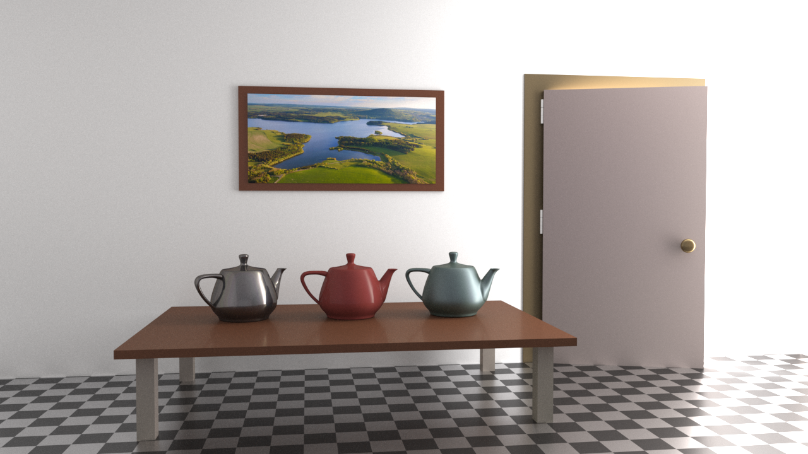

[](https://www.python.org/downloads/release/python-38/)
[](https://pytorch.org/)


# Hypernetworks for Generalizable BRDF Representation, ECCV 2024

[Project page](https://faziletgokbudak.github.io/hyper-page/) | [Arxiv](https://arxiv.org/abs/2311.15783)

[comment]: <> (| [Supplementary materials]&#40;https://inbarhub.github.io/DDPM_inversion/resources/inversion_supp.pdf&#41; | [Hugging Face Demo]&#40;https://huggingface.co/spaces/LinoyTsaban/edit_friendly_ddpm_inversion&#41;### Official pytorch implementation of the paper: <br>"Hypernetworks for Generalizable BRDF Estimation")
#### F. Gokbudak A. Sztrajman, C Zhou, F. Zhong, R. Mantiuk, and C. Oztireli
<br>


Our hypernetwork model offers a **neural continuous BRDF representation** that can be used either for sparse BRDF reconstruction of unseen materials or compression of highly densed BRDF samples. 

The figure shows a room scene rendered with our reconstructed materials, including sparse reconstruction (table top and legs, door, door and picture frames, hinge), full reconstruction through compression (the two teapots on the left, door handle) and BRDF interpolation (right-most teapot). Scene courtesy of Benedikt Bitterli.

This repository contains all necessary scripts for both training and testing our model.


## Table of Contents
* [Requirements](#Requirements)
* [Repository Structure](#Repository-Structure)
* [Usage Example](#Usage-Example)
* [Citation](#Citation)

## Requirements 

```
python -m pip install -r requirements.txt
```
This code was tested with python 3.8 and torch==1.8.1+cu111. 

## Repository Structure 
```
├── data - folder contains precomputed median files for both MERL and RGL dataset, which are necessary for our pre-processing step.
├── models.py - contains main HyperBRDF model
├── main.py - main python file for model training
└── test.py - test python file for computing hyponet parameters from **sparse** BRDF samples (inference)
└── pt_to_fullmerl.py - test python file for querying new sampling directions and reconstructing BRDFs (inference)

```

A folder named with --destdir arg will be automatically created and all the results will be saved to this folder.


## Usage Example 
Training:
```
python3 main.py --destdir results/merl --dataset Mixed --kl_weight 0.1 --fw_weight 0.1 --epochs 100
```

Inference:
```
python3 test.py ../results/merl/MERL/checkpoint.pt ../pt_results/ 'MERL'
python3 pt_to_fullmerl.py ../pt_results/ ../fullbin_results/
```

## Citation
If you use this code for your research, please cite our paper:
```
@article{gokbudak2023hypernetworks,
  title      = {Hypernetworks for Generalizable BRDF Representation},
  author     = {Fazilet Gokbudak and Alejandro Sztrajman and Chenliang Zhou and Fangcheng Zhong and Rafal Mantiuk and Cengiz Oztireli},
  booktitle = {European Conference on Computer Vision (ECCV)},
  year      = {2024}
}
```
